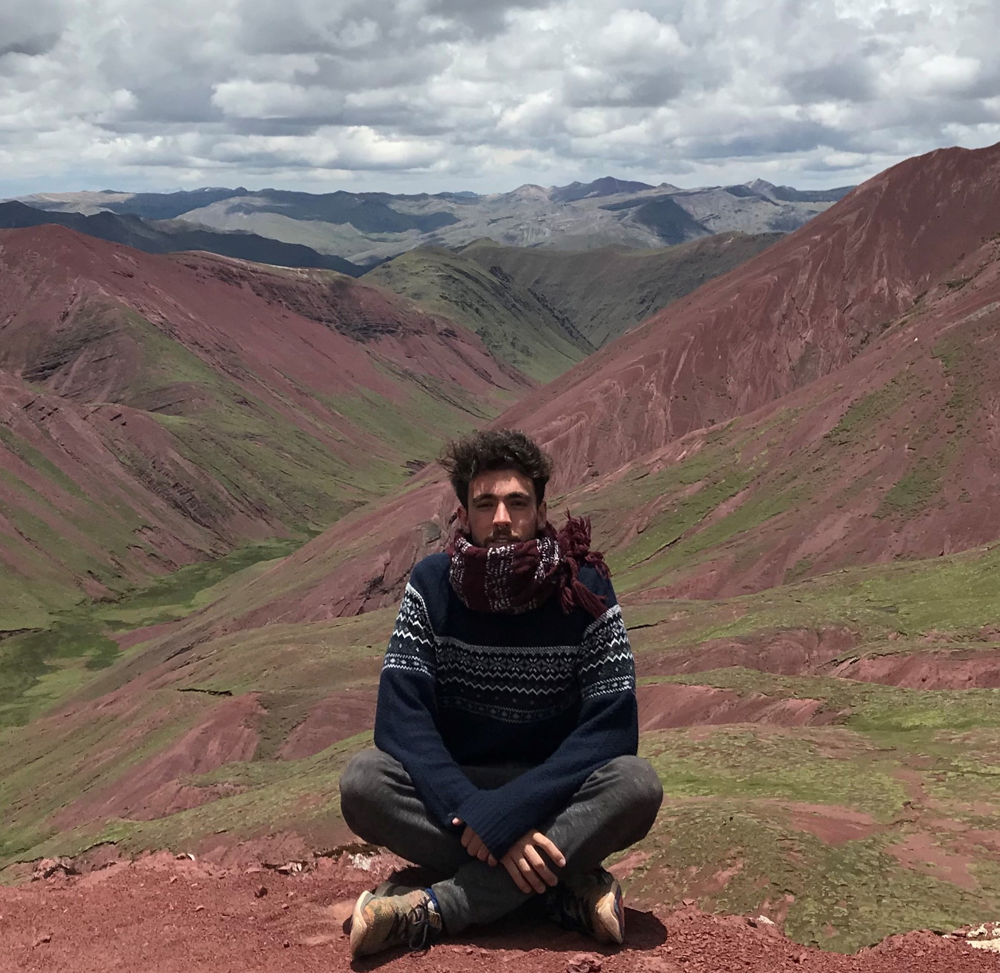

### Hello World 👋 I’m [Tomas Plevak][website]!

 

## Frontend Developer JR
- 📌 I am currently working for IBM as Application Developer JR. Working with PL/SQL and Unix - ShellScript.
- 📚 I’m learning about <b>AWS, TypeScript and Node Js</b>.
- 🎧 Music🌋 Travels and 📷 Photography are some of my favourite hobbies. 
- 📫 How to reach me: <b> tomiplevak@hotmail.com</b>

 

## Languages and Tools
<code></code>
<code></code>
<code></code>
<code></code>
<code></code>

---
[website]: https://tomiplevak.github.io/
[HTML-CSS.certificate]: https://www.freecodecamp.org/certification/tomiplevak/responsive-web-design
[JS.certificate]: https://www.freecodecamp.org/certification/tomiplevak/javascript-algorithms-and-data-structures

